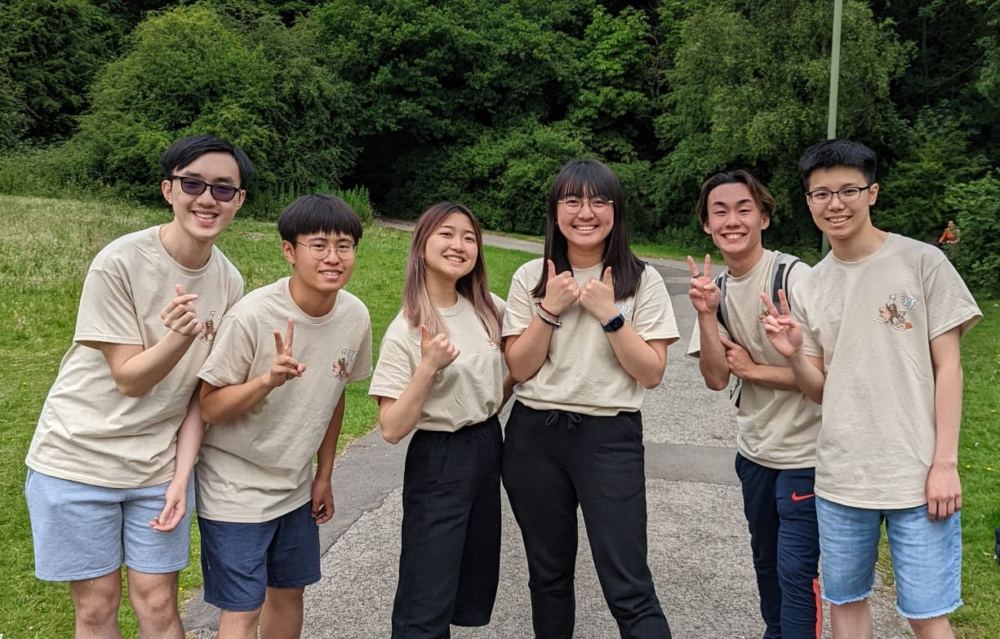

This is my little sharing *my* experience as a vice chair in CYF. There are a few notes before we start. First of all, this is a personal sharing, so views towards issues may be heavily biased, and I am always open to further discussions in these matters. Secondly, there are actually two vice-chairs, since Vera has been appointed to share some of my duties, including the member and committee interviews. Finally, the sharing is supplemented with reference materials, which are included in this website.

This has been my forth years joining CYF, and second year working in the CYF committee. It has always been my honor to serve in God's will, and the friendships and partnerships with you guys have made my final years as a teenager being more fruitful and enjoyable. I think it is always nice to reflect on how much we have achieved together - this is best reflected in your engagement in the Break-Me-Through camp, and the follow-up Instagram post for some of you. (Remark: sorry I don't really know what to write in IG so you may expect some delay for this final gratitude post or something...) I am touched in the camp not just because I am anticipating some major breakthroughs in my life, but also the opportunities God has provided us to witness His work of changing lives. I, therefore, truly give thanks to God for making use of our efforts to inspire lives in CYF and other communities around us, and look forward to further God's work.

# My general reflections
As you may all know, there is not a clear job description as a vice chair of CYF committee. The main role of being a vice chair is to support the committee (especially chair and devotional supports) by continuously monitoring the needs in fellowship, as well as to help out with duties that has not been taken up by other committees otherwise. I am sure that the upcoming chair (Vera) and vice-chair (Prudence) are fully prepared for the duty, so I don't really have much to say about what a vice chair should do in the committee. Let me therefore jump to some of the lessons learnt during my service this year.

## Lesson 1: Humbleness
I am quite surprised by how arrogant I am - perhaps because I believed my experience in CYF committee before Covid would be *valuable* to the development. 

Lessons learnt (to be filled in)
- Humbleness
    - A realisation during committee interview.
    - Drawing lines: who am I to judge?
    - Breakthrough in contents.

## Lesson 2: Trust in God, trust in committee
- Trust in committee
    - Member's incidents
    - Expectation of committee.
- Trust in God
    - Reflection on my serving role and academic developments.

## Lesson 3: Be proactive

# Important reminders
- Vision: I think having a clear direction is way more important. Also burnout.
- Time management
> Teach us to number our days, that we may gain a heart of wisdom. (Psalm 90:12)
- Understand others
- Leadership
- Enjoy!

# External Links 
- [Handover Folder](https://drive.google.com/drive/folders/19NCe_Z2RZ2sLjtIeMUMIxnJQO_eBh0Iq?usp=sharing)