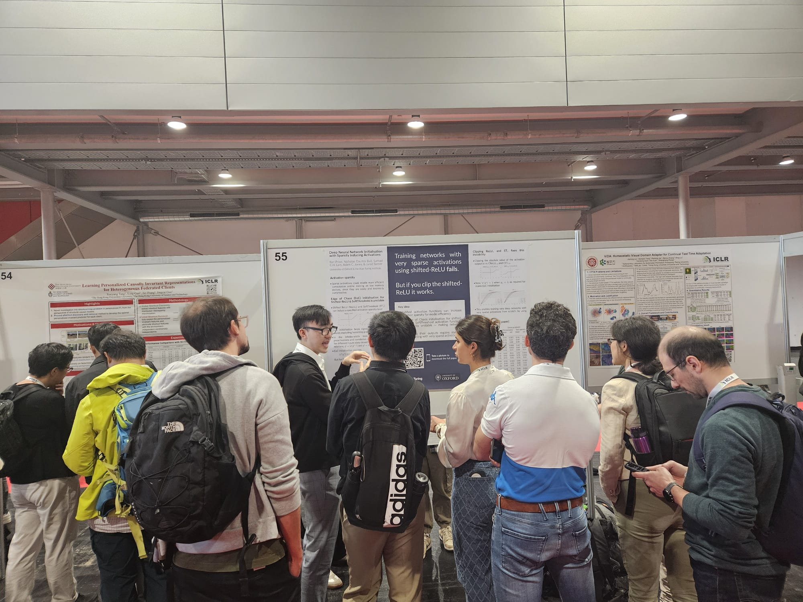

*Report on the 12th International Conference on Learning and Representations (ICLR) for Old Members’ Trust Graduate Conference and Academic Travel Fund – Samuel Lam1 (CDT Mathematics of Random Systems, University College)*

# Introduction 

The International Conference on Learning and Representations (ICLR) is one of the most prestigious conferences on machine learning. Nearly 6000 academics2 and industrial partners with diverse academic backgrounds gathered in Vienna to discuss the latest advancements in the fields. I am honoured to present, with my colleagues, a project (as poster) on the sparsity of neural network, completed as part of my Centre of Doctoral Training (CDT) programme. The trip was made possible thanks to the generous fundings from University College and the CDT programme. 

# What's on? 

We are approaching the era of Artificial General Intelligence (AGI)3, when machines will be able to perform a wide range of cognitive tasks efficiently and accurately. The conference began with accessible planetary talks on the latest news in AGI, with speakers providing insights into active research areas such as LLMs (large language models, e.g. GPT-4) and reinforcement learning (e.g. video game playing machines), as well as legal and environmental concerns in machine learning developments in general.   

There are over 2600 research groups presenting their work, and we are honoured to be one of them. Given that neural networks have always been a fundamental part of many successful machine learning models, our project provides theoretical foundations on how to train neural networks with fewer active neurons (i.e. dynamically sparse)4. We were excited to learn how to accelerate the computation of complex machine learning models such as LLMs on Graphical Processing Units (GPUs) by appropriate reprogramming to exploit the dynamical sparsity of such models.

Through the poster sessions, coffee breaks and informal socialising, I was able to explore many other areas of machine learning with which I am less familiar. My favourite topic was how to combine LLMs with mathematical proof verifiers (e.g. Lean) to automate advances in mathematics. Discussion of this topic led to reflections on philosophies of doing mathematics, e.g. what makes a mathematical statement substantial and what makes a proof elegant? These questions are crucial for guiding the computer to produce proofs that advance our understanding of mathematics. 

Finally, some of the senior researchers had kindly shared their insights into their research careers. One of the most memorable stories I heard was from Christian Szegedy, the first author of the paper that won the runner-up Best of Time Award at the conference5, about how they persevered through demotivating comments from researchers to produce their groundbreaking work on adversarial machine learning. We are also incredibly grateful to the senior researchers who gave us career advice during their office hours. 

# Vienna was a great city to visit!

Vienna is known for its profound musical culture and the legacy of the royal Habsburg family. I was happy to join a city tour the night before the conference. This gave me the opportunity to learn more about the stories behind many of Vienna's interesting buildings and to network with other conference participants. I also attended some classical music concerts outside of conference hours, including a performance of Bruckner's Symphony No. 5 by the world-class Royal Concertgebouw Orchestra at the Musikverein, and a selection of works by Mozart and Strauss at the historic palace of Hofburg.

# Conclusion 

This was the second and largest international conference I have attended in my life (the first being in Hong Kong, where I am from). This experience was truly rewarding academically, socially and musically. I look forward to sharing more of my experiences with the diverse communities in the College and the Department - but for now, thank you for your generous support in making this trip possible.